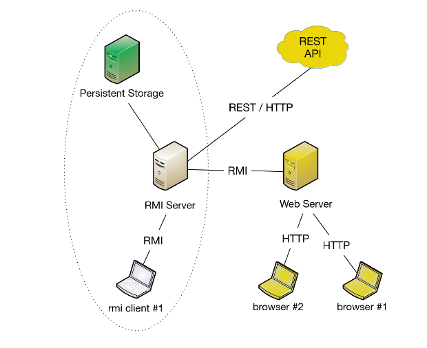

# ds-project
## Distributed Systems - BSc Course - University of Coimbra - 2018/2019
This repository contains the project assignment for the Distributed Systems subject (2018/2019 edition) on the Bachelor's Degree in Informatics Engineering course from the University of Coimbra

The objective of the project was to create a distributed system following the architecture bellow

This project was developed in java (using struts 2 for the web server)

Credits to [Raul Barbosa](https://github.com/rbbarbosa) as the teacher of the subject
